# Advanced Climate Control System with RTC and LCD

A comprehensive embedded system for climate control featuring real-time monitoring, automated regulation, and safety mechanisms. This system is designed for greenhouses, terrariums, or any environment requiring precise climate control.

##  Hardware Requirements & Memory Considerations

**Important**: This project requires significant memory resources due to its comprehensive features. It **will NOT fit on Arduino Uno** (32KB flash, 2KB RAM)!

### Recommended Microcontrollers:

| Board | Flash Memory | RAM | Recommended | Notes |
|-------|-------------|-----|-------------|-------|
| **Arduino Mega 2560** | 256KB | 8KB | ✅ Highly Recommended | Best compatibility, 70+ digital pins |
| **ESP32** | 4MB+ | 520KB | ✅ Excellent | Built-in WiFi/Bluetooth, more powerful |
| **Arduino Due** | 512KB | 96KB | ✅ Great | 32-bit ARM Cortex-M3, 84MHz |
| **Teensy 4.0** | 2MB | 1MB | ✅ Excellent | 600MHz, very fast, lots of memory |
| **Arduino Nano** | 32KB | 2KB | ❌ Will NOT work | Too small |
| **Arduino Uno** | 32KB | 2KB | ❌ Will NOT work | Too small |

### Memory Usage Estimates:
- **Flash Memory**: ~35-45KB (compiled with all features)
- **RAM Usage**: ~4-6KB (during operation)
- **Minimum Requirements**: 64KB Flash, 8KB RAM recommended

## Features

###  Climate Control
- **Temperature Regulation**: PID-controlled heating/cooling with DHT11 sensor
- **Humidity Control**: Automatic humidifier control with hysteresis
- **Safety Limits**: Configurable min/max temperature/humidity boundaries
- **Calibration**: Software calibration offsets for all sensors

###  Smart Lighting System
- **Time-based Scheduling**: Automatic on/off times using DS1302 RTC
- **Smooth Transitions**: Gradual fade in/out over configurable duration
- **Ambient Adaptation**: Light sensor integration for automatic adjustment
- **Manual Override**: Direct control via serial commands or menu

###  Safety & Reliability
- **Watchdog Timer**: Automatic system recovery from hangs (2-second timeout)
- **Emergency Stop**: Hardware interrupt button for immediate shutdown
- **EEPROM Storage**: Persistent settings across power cycles
- **Error Handling**: Comprehensive sensor failure detection and recovery
- **Relay Protection**: Minimum on/off times to prevent wear

###  User Interface
- **LCD Display**: 20x4 character display with I2C interface
- **Menu Navigation**: Rotary encoder with push-button for intuitive control
- **Serial Interface**: Full command set via 9600 baud serial connection
- **Real-time Status**: Continuous display of all system parameters

###  Technical Features
- **Modular Architecture**: Object-oriented design with separate classes
- **Configurable PID**: Adjustable P, I, D parameters for temperature control
- **RTC Synchronization**: Automatic timekeeping with battery backup
- **Modular Design**: Easy to add new sensors or actuators
- **Debug Mode**: Conditional compilation for troubleshooting

##  Hardware Requirements

### Essential Components:

| Component | Model | Qty | Purpose | Notes |
|-----------|-------|-----|---------|-------|
| Microcontroller | **Arduino Mega 2560** or **ESP32** | 1 | Main controller | Do NOT use Uno/Nano |
| Temp/Humidity Sensor | DHT11 or DHT22 | 1 | Climate sensing | DHT22 more accurate |
| Real-Time Clock | DS1302 with battery | 1 | Timekeeping | CR2032 battery needed |
| LCD Display | 20x4 I2C Character LCD | 1 | User interface | Address usually 0x27 |
| Rotary Encoder | KY-040 | 1 | Menu navigation | Includes push-button |
| Light Sensor | Photoresistor (LDR) | 1 | Ambient light | 10kΩ resistor needed |
| Relays/Modules | 5V Relay modules | 2-3 | Control devices | For heater, humidifier, light |
| Emergency Button | Tactile switch | 1 | Safety stop | Normally open |
| Breadboard | 400/800 points | 1 | Prototyping | Solder board for final |
| Jumper Wires | Male-Male, Male-Female | 40+ | Connections | Various lengths |
| Power Supply | 7-12V DC, 2A | 1 | System power | Barrel jack or terminal |

### Optional Components:
- **Level Shifter**: 5V↔3.3V if mixing 5V/3.3V devices
- **SD Card Module**: For data logging
- **WiFi Module**: ESP8266/ESP32 for remote monitoring
- **Buzzer**: Audible alarms
- **Status LEDs**: Visual indicators

## Installation & Setup

### 1. Clone Repository
```git bush
git clone https://github.com/01MEG10/climateControlSystem.git
cd climateControlSystem
```


### 2. Install Arduino Libraries

Install via Arduino Library Manager (Sketch → Include Library → Manage Libraries):

DHT sensor library by Adafruit (v1.4.4+)

Rtc by Makuna (DS1302 library)

LiquidCrystal_I2C by Frank de Brabander

Encoder by Paul Stoffregen

Time library (optional, for ESP32)

Or manually install from:

Adafruit DHT: https://github.com/adafruit/DHT-sensor-library

Rtc by Makuna: https://github.com/Makuna/Rtc

LiquidCrystal_I2C: https://github.com/johnrickman/LiquidCrystal_I2C

### 3. Hardware Connections
Arduino Mega 2560 Pinout:


| Component  | Pin | Function | Notes |
|------------|-----|----------|-------|
|DHT11 | 2 | Data | 10kΩ pull-up to 5V|
|DS1302 CE| 8 | Chip Enable | |
|DS1302 IO| 9 | Data | |
|DS1302 SCLK| 10 | Clock | |
|Rotary Encoder CLK |	11	|Clock|
|Rotary Encoder DT	|12	|Data| |	
|Rotary Encoder SW	|13	|Switch	|Internal pull-up| 
|Emergency Button|	6	|Interrupt	|Internal pull-up
|Light Sensor	|A0	|Analog input	|With voltage divider
|Heater Relay|	5|	PWM output	|MOSFET/Relay
|Humidifier Relay|	4|	Digital output	|Relay module
|Light Control|	3	|PWM output	|MOSFET/SSR for dimming
|LCD I2C	|SDA, SCL|	I2C	|A4(SDA), A5(SCL) on Mega

Power Connections:

- DS1302: VCC → 5V, GND → GND

- DHT11: VCC → 5V, GND → GND, DATA → Pin 2

- LCD I2C: VCC → 5V, GND → GND, SDA → 20, SCL → 21

- KY-018: CLK → 11, DT → 12, SW → 13, + → 5V, GND → GND

- LDR: One leg → 5V, Other leg → A0 + 10kΩ to GND

### 4. Arduino IDE Configuration
1. Open Climat_control_system.cpp in Arduino IDE

2. Select board: Tools → Board → Arduino Mega or Mega 2560

3. Select processor: Tools → Processor → ATmega2560

4. Select port: Tools → Port → COMx (Arduino Mega)

5. Optimize: Tools → Optimize → "Smallest Code"

6. Verify: Sketch → Verify/Compile (Ctrl+R)


### 5. Upload and Test
1. Click Upload (Ctrl+U)

2. Open Serial Monitor: Tools → Serial Monitor (Ctrl+Shift+M)

3. Set baud rate to 9600

4. You should see welcome message and system status

##  Usage Instructions

### Serial Commands (9600 baud):
```
status      - Show complete system status
time        - Display current RTC time
settime HH:MM:SS - Set time (24-hour format)
setdate DD/MM/YY - Set date
lighton HH:MM    - Set light ON time
lightoff HH:MM   - Set light OFF time
lightschedule on/off - Enable/disable light schedule
temp X      - Set target temperature (10.0-40.0°C)
humid X     - Set target humidity (20.0-80.0%)
save        - Save settings to EEPROM
load        - Load settings from EEPROM
reset       - Reset system (soft reset)
stop        - Emergency stop (shutdown all outputs)
help        - Display all available commands
```

### LCD Menu Navigation:

1. Rotate Encoder: Scroll through menu options

2. Press Encoder Button: Select current option

3. Rotate in Edit Mode: Adjust values

4. Press in Edit Mode: Save changes

5. Long Press: Emergency stop (if configured)

### Menu Structure:

```
MAIN SCREEN (Status Display)
  ↓ Press
MAIN MENU
  ├─ Temperature Settings
  │   ├─ Set Target Temperature
  │   ├─ PID: P Factor
  │   ├─ PID: I Factor
  │   └─ PID: D Factor
  ├─ Humidity Settings
  │   └─ Set Target Humidity
  ├─ Light Settings
  │   ├─ Light ON Time
  │   ├─ Light OFF Time
  │   ├─ Schedule Enable/Disable
  │   └─ Light Intensity
  ├─ Time Settings
  │   ├─ Set Time
  │   ├─ Set Date
  │   └─ RTC Sync
  ├─ System Info
  ├─ Reset System
  ├─ Emergency Stop
  ├─ Save to EEPROM
  └─ Back to Main
  ```

## Project architecture

```mermaid
graph TB
    START[Запуск системы] --> SETUP[Настройка]
    
    SETUP --> INIT_PINS[Инициализация пинов]
    SETUP --> INIT_SERIAL[Инициализация Serial]
    SETUP --> INIT_RTC[Инициализация RTC]
    SETUP --> INIT_LCD[Инициализация LCD]
    SETUP --> INIT_ENCODER[Инициализация энкодера]
    SETUP --> INIT_WATCHDOG[Инициализация Watchdog]
    SETUP --> LOAD_SETTINGS[Загрузка настроек из EEPROM]
    
    LOAD_SETTINGS --> MAIN_LOOP[Главный цикл]
    
    MAIN_LOOP --> UPDATE_RTC[Обновление времени RTC]
    UPDATE_RTC --> UPDATE_LIGHT_SCHEDULE[Обновление расписания освещения]
    
    MAIN_LOOP --> CHECK_SENSORS{Проверка таймера датчиков}
    CHECK_SENSORS -->|Да| READ_SENSORS[Чтение датчиков]
    READ_SENSORS --> PROCESS_MEASUREMENTS[Обработка измерений]
    
    PROCESS_MEASUREMENTS --> CHECK_VALIDITY{Данные валидны?}
    CHECK_VALIDITY -->|Да| CONTROL_TEMP[Управление температурой]
    CHECK_VALIDITY -->|Да| CONTROL_HUMID[Управление влажностью]
    CHECK_VALIDITY -->|Да| CONTROL_LIGHT[Управление светом]
    CHECK_VALIDITY -->|Нет| INCREMENT_ERRORS[Увеличение счетчика ошибок]
    
    CONTROL_TEMP --> PID_CALCULATION[Расчет PID]
    CONTROL_TEMP --> CHECK_SAFETY{Проверка безопасности}
    CHECK_SAFETY -->|Норма| APPLY_PWM[Применение PWM к нагревателю]
    CHECK_SAFETY -->|Перегрев| OVERHEAT_PROTECTION[Защита от перегрева]
    
    CONTROL_HUMID --> CHECK_HYSTERESIS{Проверка гистерезиса}
    CHECK_HYSTERESIS -->|Включить| HUMIDIFIER_ON[Включение увлажнителя]
    CHECK_HYSTERESIS -->|Выключить| HUMIDIFIER_OFF[Выключение увлажнителя]
    
    CONTROL_LIGHT --> CHECK_SCHEDULE{Расписание активно?}
    CHECK_SCHEDULE -->|Да| CALCULATE_LIGHT[Расчет уровня света по времени]
    CHECK_SCHEDULE -->|Нет| LIGHT_OFF[Свет выключен]
    CALCULATE_LIGHT --> APPLY_LIGHT_PWM[Применение PWM к свету]
    
    MAIN_LOOP --> CHECK_SERIAL{Команды Serial?}
    CHECK_SERIAL -->|Да| PROCESS_COMMAND[Обработка команд]
    PROCESS_COMMAND --> STATUS[Статус]
    PROCESS_COMMAND --> SET_TIME[Установка времени]
    PROCESS_COMMAND --> SET_TEMP[Установка температуры]
    PROCESS_COMMAND --> SET_HUMID[Установка влажности]
    PROCESS_COMMAND --> SET_LIGHT[Настройка света]
    PROCESS_COMMAND --> EMERGENCY_STOP[Аварийная остановка]
    PROCESS_COMMAND --> RESET[Сброс системы]
    
    MAIN_LOOP --> UPDATE_LCD[Обновление LCD дисплея]
    UPDATE_LCD --> DISPLAY_MAIN[Главный экран]
    UPDATE_LCD --> DISPLAY_MENU[Меню]
    UPDATE_LCD --> DISPLAY_SETTINGS[Настройки]
    
    MAIN_LOOP --> UPDATE_ENCODER[Обработка энкодера]
    UPDATE_ENCODER --> ROTATION[Вращение]
    UPDATE_ENCODER --> BUTTON[Нажатие кнопки]
    ROTATION --> NAVIGATE_MENU[Навигация по меню]
    BUTTON --> SELECT_ITEM[Выбор пункта]
    
    MAIN_LOOP --> MONITOR_HEALTH[Мониторинг состояния]
    MONITOR_HEALTH --> CHECK_EMERGENCY{Аварийная кнопка?}
    CHECK_EMERGENCY -->|Нажата| ACTIVATE_EMERGENCY[Активация аварийного режима]
    MONITOR_HEALTH --> CHECK_WATCHDOG[Кормление Watchdog]
    MONITOR_HEALTH --> CHECK_ERRORS{Слишком много ошибок?}
    CHECK_ERRORS -->|Да| SYSTEM_RESET[Сброс системы]
    
    MAIN_LOOP --> UPDATE_STATUS[Обновление статуса системы]
    
    ACTIVATE_EMERGENCY --> TURN_OFF_ALL[Отключение всех устройств]
    SYSTEM_RESET --> REINITIALIZE[Повторная инициализация]
    
    TURN_OFF_ALL --> MAIN_LOOP
    REINITIALIZE --> MAIN_LOOP
    APPLY_PWM --> MAIN_LOOP
    HUMIDIFIER_ON --> MAIN_LOOP
    HUMIDIFIER_OFF --> MAIN_LOOP
    APPLY_LIGHT_PWM --> MAIN_LOOP
    LIGHT_OFF --> MAIN_LOOP
    INCREMENT_ERRORS --> MAIN_LOOP
    OVERHEAT_PROTECTION --> MAIN_LOOP
    NAVIGATE_MENU --> MAIN_LOOP
    SELECT_ITEM --> MAIN_LOOP
    DISPLAY_MAIN --> MAIN_LOOP
    STATUS --> MAIN_LOOP
    SET_TIME --> MAIN_LOOP
    SET_TEMP --> MAIN_LOOP
    SET_HUMID --> MAIN_LOOP
    SET_LIGHT --> MAIN_LOOP
    EMERGENCY_STOP --> MAIN_LOOP
    RESET --> MAIN_LOOP
    
    style START fill:#90EE90
    style ACTIVATE_EMERGENCY fill:#FF9999
    style SYSTEM_RESET fill:#FF9999
    style EMERGENCY_STOP fill:#FF9999
    style TURN_OFF_ALL fill:#FF9999
```


##  Configuration

### Adjustable Parameters in Code:
```cpp
// In Climat_control_system.cpp, modify these constants:

// Safety Limits
#define MAX_SAFE_TEMPERATURE 45.0f    // Maximum safe temperature
#define MIN_SAFE_TEMPERATURE 5.0f     // Minimum safe temperature
#define MAX_SAFE_HUMIDITY 90.0f       // Maximum safe humidity
#define MIN_SAFE_HUMIDITY 10.0f       // Minimum safe humidity

// Light Schedule
#define DEFAULT_LIGHT_ON_HOUR 7       // 7:00 AM
#define DEFAULT_LIGHT_OFF_HOUR 22     // 10:00 PM
#define LIGHT_TRANSITION_DURATION 10  // Minutes for fade in/out

// Control Parameters
#define HUMIDIFIER_HYSTERESIS 3.0f    // Humidity hysteresis
#define SENSOR_READ_INTERVAL 9000     // 9 seconds between readings

// PID Settings (for temperature control)
PIDFactor defaultPid = {1.0, 0.5, 0.02, 0, 255};
```

### Pin Configuration:
If you need to change pins, modify these definitions:
```cpp
#define PIN_DHT_SENSOR 2
#define PIN_LIGHT_SENSOR A0
#define PIN_HEATER_COOLER_POWER 5
#define PIN_HUMIDIFIER_POWER 4
#define PIN_LIGHT_POWER 3
#define PIN_EMERGENCY_BUTTON 6
#define PIN_RTC_CE 8
#define PIN_RTC_IO 9
#define PIN_RTC_SCLK 10
#define PIN_ENCODER_CLK 11
#define PIN_ENCODER_DT 12
#define PIN_ENCODER_SW 13
```

##  Troubleshooting

### Common Issues and Solutions:

|Issue|	Symptoms|	Solution|
|-----|---------|-----------|
|Compilation Errors |	"Sketch too big", memory warnings |	Use Arduino Mega 2560, not Uno. Reduce features if needed.|
|LCD Not Working	|Blank screen, garbled character|	Check I2C address (try 0x27 or 0x3F). Verify wiring (SDA/SCL).
|DHT Sensor Errors	|"Failed to read", NAN values	|Add 10kΩ pull-up resistor between DATA and 5V. Check wiring.
|RTC Not Keeping Time|	Wrong time after power cycle|	Replace CR2032 battery. Verify CE/IO/SCLK connections.
|Encoder Unreliable|	Menu jumps, false triggers	|Add 0.1µF capacitors between pins and ground (debouncing).
|Serial Not Responding	|No output in Serial Monitor|	Set baud rate to 9600. Check RX/TX connections if using hardware serial.
|Relays Not Switching|	No click sound, devices not turning on|	Check relay module power (JD-VCC to 5V). Verify control signal.
|System Resets Unexpectedly| Watchdog resets, restarting	|Check power supply (needs 7-12V, 2A). Add 100µF capacitor across 5V/GND.

### Debug Mode:

Enable debug output by uncommenting in code:
```cpp
// Change from:
// #define DEBUG_MODE

// To:
#define DEBUG_MODE
```

##  Expected Performance

### Typical Operation:
- Temperature Accuracy: ±1.0°C (with DHT11), ±0.5°C (with DHT22)

- Humidity Accuracy: ±5% (DHT11), ±2% (DHT22)

- Control Response: 2-5 minutes to reach target temperature

- Power Consumption: 100-500mA (depending on connected devices)

- Sensor Update Rate: Every 9 seconds

- LCD Refresh Rate: 500ms

### Safety Features in Action:
1. Over-temperature: Shuts off heater at 45°C

2. Under-temperature: Full power heating below 5°C

3. Sensor Failure: System enters safe mode

4. Watchdog: Auto-reset after 2 seconds of inactivity

5. Emergency Stop: Immediate shutdown of all outputs

##  For Low-Memory Boards (Alternative Configuration)
If you must use a smaller board, create a config_minimal.h:

```cpp
// Reduce buffer sizes:
#define FILTER_SIZE 3                // Was 5
#define SERIAL_BUFFER_SIZE 32        // Was 64
#define MENU_ITEMS_MAX 5             // Was 10
```

## Contributing
Contributions are welcome! Here's how to help:

1. Report Bugs: Open an issue with detailed description

2. Suggest Features: Use the issue tracker for feature requests

3. Submit Code: Fork the repo and create a pull request

4. Improve Documentation: Fix typos or add more examples

## License
This project is licensed under the MIT License - see the LICENSE file for details.

**Disclaimer**: This is an educational project. Use at your own risk. The authors are not responsible for any damage caused by incorrect wiring or usage.

## Author

**Miroslav Merenkov** 
- GitHub: @01MEG10

- Email: miroslav10042008@gmail.com

- Project Link: https://github.com/01MEG10/climateControlSystem

